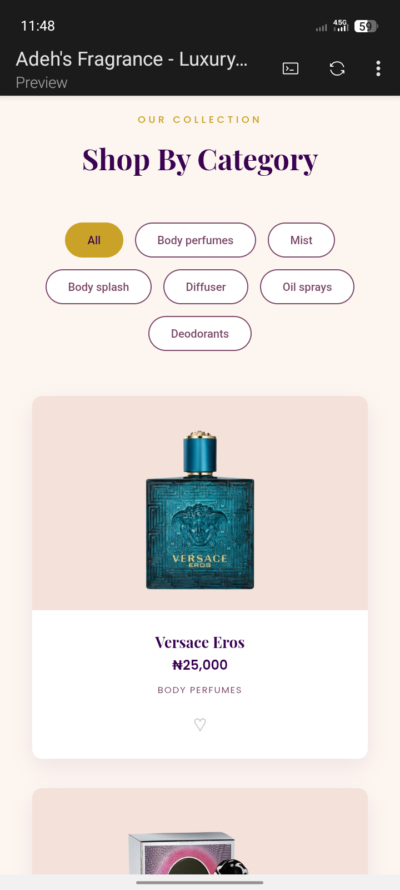

# Adeh's Fragrance

A responsive e-commerce landing page for a fragrance store, offering designer perfumes, mists, diffusers, body splashes, oil sprays, and deodorants.

## Preview 

## Links
Github: [https://github.com/DevAdeh/Adehs-Fragrance-.git]

Live: [https://adehs-fragrance.vercel.app/]

## Overview

Adeh's Fragrance is a storefront web page where customers can browse a curated collection of fragrance products by category and get the details they need to make a purchase — built to turn an attractive product display into an actual shopping experience.

Users should be able to:

- View the optimal layout depending on their device's screen size
- Browse all products or filter by category (Body perfumes, Mist, Body splash, Diffuser, Oil sprays, Deodorants)
- View each product's name, price, and category at a glance
- Save favorite products for later
- Explore the full collection via a clear call-to-action

## Built With

- HTML5
- CSS3
- JavaScript
- Flexbox / Grid
- CSS Media Queries

## Features

- Hero section with brand tagline and call-to-action button
- Category filter tabs (All, Body perfumes, Mist, Body splash, Diffuser, Oil sprays, Deodorants)
- Responsive product grid with images, names, prices, and categories
- Favorite/wishlist icon on each product card
- Mobile-friendly, responsive layout across all screen sizes

## What I Learnt

While building this project, I practiced:

- Structuring a multi-category product filtering system with JavaScript
- Building a responsive product grid layout
- Designing a clean, brand-consistent visual identity (purple and gold luxury theme)
- Structuring a project using separate HTML, CSS, and JavaScript files
- Thinking beyond visuals — making sure every design element serves a functional purpose for the customer

## Author

Adeola Ejikunle — [GitHub](https://github.com/DevAdeh)